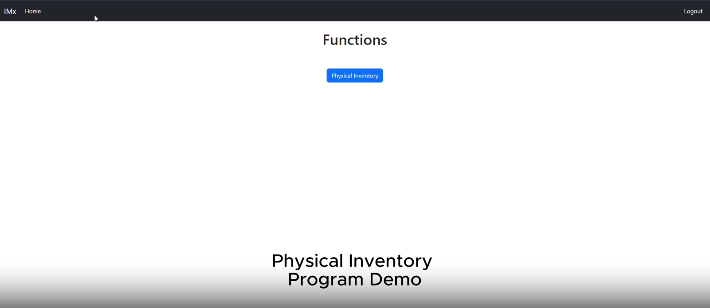

# Inventory Management

This application allows for cycle counts to be generated for physical locations so that inventory accuracy can be determined.

## Scope

The scope of this application was to replace a manual cycle counting process. The methodology used to generate counts can be changed to match different use cases.

## Demo

You can watch a demo of the project on YouTube by clicking the link below:

This demo walks through the complete process of generating and entering physical inventory counts.

## Live Demo

You can access a live demo of the application by following this link: [Live Demo](https://example.com)

### Demo Credentials

To access the live demo, use the following credentials:

- Username: `admin`
- Password: `root`
